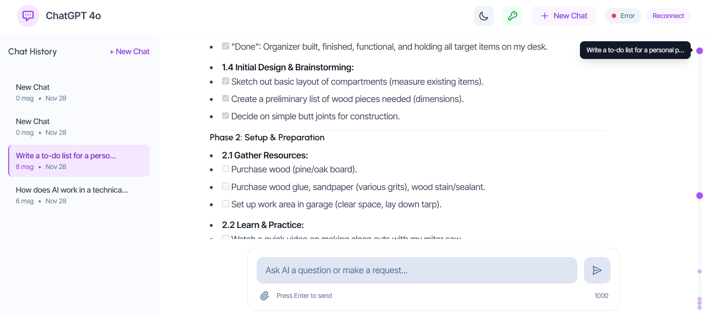
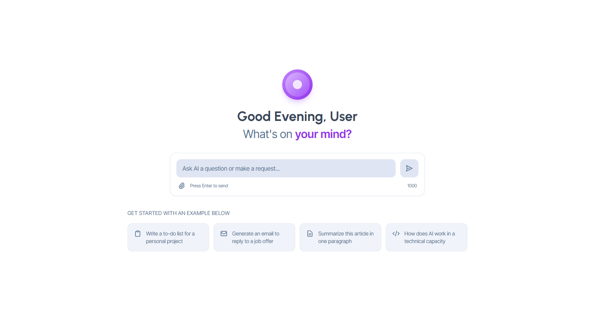
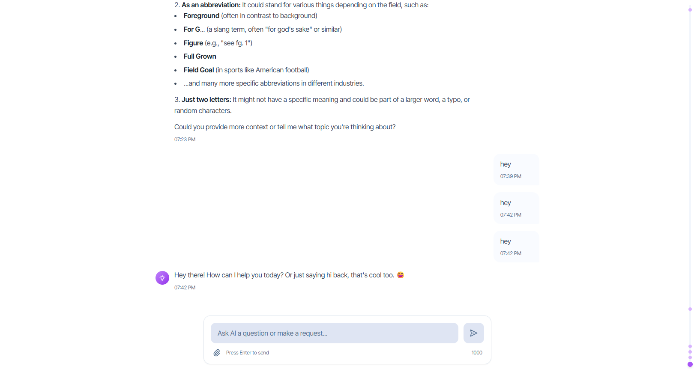
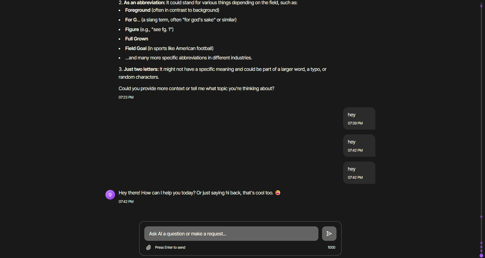
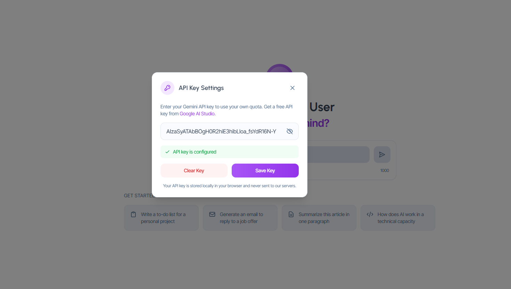
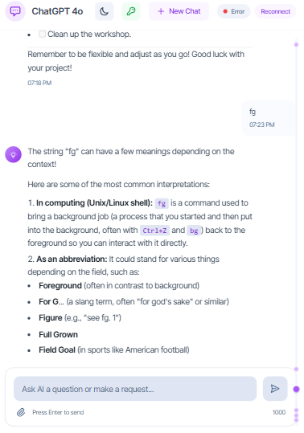

# 🤖 Real-Time AI Chatbot with WebSocket Streaming

A modern, real-time AI chatbot application built with React, TypeScript, and WebSocket technology. Features streaming responses from Google's Gemini AI, dark/light theme support, and a beautiful responsive UI.



## 📺 Demo Video

🎥 **[Watch Demo Video]("https://www.loom.com/share/9d0019ef600d4edfbd862ec022d29c9f")**

---

## ✨ Features

- **🚀 Real-Time Streaming** - AI responses stream in real-time using WebSocket technology
- **🤖 Google Gemini AI** - Powered by Gemini 2.5 Flash for fast, intelligent responses
- **🌙 Dark/Light Theme** - Beautiful UI with full dark mode support
- **💾 Chat History** - Persistent chat sessions stored in localStorage
- **📝 Markdown Support** - Rich text formatting with code blocks, tables, and more
- **🔑 Custom API Key** - Use your own Gemini API key from the frontend
- **📱 Responsive Design** - Works seamlessly on desktop and mobile
- **📋 Copy to Clipboard** - Easy copy functionality for messages
- **🗂️ Session Management** - Create, switch, clear, and delete chat sessions
- **⚡ Auto-Reconnect** - Automatic WebSocket reconnection on disconnect

---

## 🛠️ Tech Stack

### Frontend

| Technology     | Purpose                 |
| -------------- | ----------------------- |
| React 18       | UI library              |
| TypeScript     | Type-safe JavaScript    |
| Vite           | Fast build tool         |
| Tailwind CSS   | Utility-first styling   |
| react-markdown | Markdown rendering      |
| WebSocket API  | Real-time communication |

### Backend

| Technology            | Purpose                  |
| --------------------- | ------------------------ |
| Node.js               | Runtime environment      |
| TypeScript            | Type-safe JavaScript     |
| ws                    | WebSocket server library |
| @google/generative-ai | Gemini AI SDK            |
| dotenv                | Environment variables    |

---

## 📁 Project Structure

```
chat-websocket/
├── frontend/                 # React frontend application
│   ├── src/
│   │   ├── components/       # React components
│   │   │   ├── ChatMessage.tsx      # Message display with markdown
│   │   │   ├── ChatInput.tsx        # User input field
│   │   │   ├── RecentMessages.tsx   # Chat history sidebar
│   │   │   ├── ApiKeySettings.tsx   # API key configuration modal
│   │   │   ├── ThemeToggle.tsx      # Dark/light mode toggle
│   │   │   ├── TypingIndicator.tsx  # Loading animation
│   │   │   ├── ScrollIndicator.tsx  # Message navigation
│   │   │   ├── SuggestionCards.tsx  # Quick start suggestions
│   │   │   └── ConnectionIndicator.tsx
│   │   ├── hooks/
│   │   │   └── useWebSocket.ts      # WebSocket connection hook
│   │   ├── context/
│   │   │   └── ThemeContext.tsx     # Theme provider
│   │   ├── types/
│   │   │   └── index.ts             # TypeScript interfaces
│   │   ├── App.tsx                  # Main application
│   │   ├── main.tsx                 # Entry point
│   │   └── index.css                # Global styles
│   ├── package.json
│   ├── tailwind.config.js
│   ├── tsconfig.json
│   └── vite.config.ts
│
├── backend/                  # Node.js backend server
│   ├── src/
│   │   ├── index.ts          # WebSocket server & message handling
│   │   └── gemini.ts         # Gemini AI integration & streaming
│   ├── package.json
│   ├── tsconfig.json
│   ├── .env                  # Environment variables (git-ignored)
│   └── .env.example          # Example environment file
│
├── docs/                     # Documentation assets
│   └── screenshots/
│
├── README.md                 # This file
├── .gitignore
└── LICENSE
```

---

## 🚀 Getting Started

### Prerequisites

Before you begin, ensure you have the following installed:

- **Node.js** (v18 or higher) - [Download](https://nodejs.org/)
- **npm** (comes with Node.js) or **yarn**
- **Git** - [Download](https://git-scm.com/)

### Step 1: Clone the Repository

```bash
git clone https://github.com/shakshipatel/chat-websocket.git
cd chat-websocket
```

### Step 2: Get a Gemini API Key (Free)

1. Visit [Google AI Studio](https://aistudio.google.com/app/apikey)
2. Sign in with your Google account
3. Click **"Create API Key"**
4. Copy the generated key (starts with `AIza...`)

### Step 3: Setup Backend

```bash
# Navigate to backend folder
cd backend

# Install dependencies
npm install

# Create environment file
cp .env.example .env

# Edit .env and add your API key (optional - can set from frontend)
# GEMINI_API_KEY=your_api_key_here

# Start the server
npm run dev
```

✅ You should see: `🚀 WebSocket server running on ws://localhost:8080`

### Step 4: Setup Frontend

```bash
# Open a NEW terminal window
# Navigate to frontend folder
cd frontend

# Install dependencies
npm install

# Start the development server
npm run dev
```

✅ You should see: `Local: http://localhost:3000`

### Step 5: Configure API Key in App

1. Open `http://localhost:3000` in your browser
2. Click the **🔑 Key icon** in the header
3. Paste your Gemini API key
4. Click **Save**

### Step 6: Start Chatting! 🎉

Type a message and press Enter. The AI will respond in real-time!

---

## 📸 Screenshots

<details>
<summary>Click to view screenshots</summary>

### Welcome Screen



### Chat Interface - Light Theme



### Chat Interface - Dark Theme



### API Key Settings



### Mobile View



</details>

---

## 🔧 Available Scripts

### Backend (`/backend`)

| Command         | Description                              |
| --------------- | ---------------------------------------- |
| `npm run dev`   | Start development server with hot reload |
| `npm run build` | Compile TypeScript to JavaScript         |
| `npm start`     | Start production server                  |

### Frontend (`/frontend`)

| Command           | Description                       |
| ----------------- | --------------------------------- |
| `npm run dev`     | Start development server with HMR |
| `npm run build`   | Build for production              |
| `npm run preview` | Preview production build locally  |

---

## 🌐 WebSocket API Reference

### Message Types

#### Client → Server

```typescript
// Send a chat message
{
  "type": "chat",
  "content": "Hello, how are you?",
  "apiKey": "optional_api_key"  // If not set in server .env
}

// Set API key for the session
{
  "type": "set_api_key",
  "apiKey": "your_gemini_api_key"
}
```

#### Server → Client

```typescript
// Connection established
{ "type": "connected", "sessionId": "uuid-here" }

// Message received acknowledgment
{ "type": "message_received", "messageId": "uuid-here" }

// AI response stream started
{ "type": "stream_start", "messageId": "uuid-here" }

// AI response chunk (sent multiple times)
{ "type": "stream_chunk", "messageId": "uuid-here", "content": "Hello" }

// AI response complete
{ "type": "stream_end", "messageId": "uuid-here", "fullContent": "Hello! How can I help you today?" }

// Error occurred
{ "type": "error", "error": "Error message here" }
```

---

## 🎨 Customization Guide

### Changing Theme Colors

Edit `frontend/tailwind.config.js`:

```javascript
theme: {
  extend: {
    colors: {
      'text-primary': '#394759',      // Main text color
      'text-secondary': '#6C7B8A',    // Secondary text
      'bg-opaque': '#FFFFFF',         // Main background
      'bg-light': '#F9FBFF',          // Light background
    }
  }
}
```

### Changing AI Model

Edit `backend/src/gemini.ts`:

```typescript
// Available models:
// - gemini-2.5-flash (fast, recommended)
// - gemini-pro (balanced)
// - gemini-1.5-pro (advanced)

return genAI.getGenerativeModel({
  model: "gemini-2.5-flash",
});
```

### Changing WebSocket Port

1. Edit `backend/.env`:

   ```env
   PORT=3001
   ```

2. Edit `frontend/src/hooks/useWebSocket.ts`:
   ```typescript
   const WS_URL = "ws://localhost:3001";
   ```

---

## 📄 License

This project is licensed under the MIT License - see the [LICENSE](LICENSE) file for details.

```
MIT License

Copyright (c) 2024 Shakshi

Permission is hereby granted, free of charge, to any person obtaining a copy
of this software and associated documentation files (the "Software"), to deal
in the Software without restriction, including without limitation the rights
to use, copy, modify, merge, publish, distribute, sublicense, and/or sell
copies of the Software, and to permit persons to whom the Software is
furnished to do so, subject to the following conditions:

The above copyright notice and this permission notice shall be included in all
copies or substantial portions of the Software.
```

---

## 🙏 Acknowledgments

- [Google Gemini AI](https://ai.google.dev/) - AI capabilities
- [Tailwind CSS](https://tailwindcss.com/) - Styling framework
- [React](https://react.dev/) - UI library
- [Vite](https://vitejs.dev/) - Build tool

---

<p align="center">
  Made with ❤️ by Shakshi
</p>

